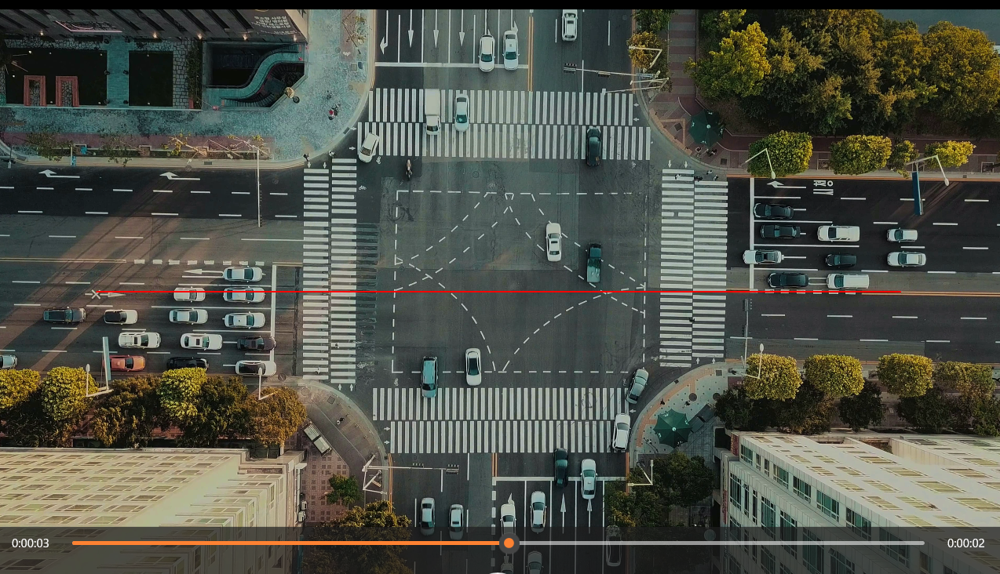

# Soft Computing Projects - 7th Semester

This repository contains three projects completed for the **Soft Computing** course during the 7th semester. All projects address problems related to **computer vision** and involve various techniques to process and analyze images and videos.

## Projects Overview

### 1. **Detection of Pokémon Squintille in Images**

- **Problem**: The goal of this project was to detect the Pokémon **Squintille** in a series of images.
- **Techniques Used**: 
  - **Image segmentation** was employed to isolate and detect the target Pokémon in various images.
  - The project aimed to achieve accurate detection while minimizing error.
  
- **Performance**: 
  - On a set of **10 sample images**, the model achieved a **Mean Absolute Error (MAE)** of **0.4**.


#### Example Outputs:


---


### 2. **Counting Cars Crossing a Red Line in Intersection Videos**

- **Problem**: The objective was to count the number of cars crossing a red line in video footage of an intersection.
- **Techniques Used**:
  - **Line detection** to identify the red line in the video frames.
  - Training was performed using images that were classified as cars or non-cars.
  - The system then processed the video frames to detect vehicles crossing the line.
  - **Histogram of Oriented Gradients (HOG)** descriptor was used for car detection.

- **Performance**: 
  - Tested on **4 videos** with different zoom levels, the system achieved a **Mean Absolute Error (MAE)** of **2**.


#### Segment 1:

---

### 3. **Recognition of Russian Words from CAPTCHA**

- **Problem**: The goal was to recognize and display **Russian words** from CAPTCHA images.
- **Techniques Used**:
  - **Optical Character Recognition (OCR)** was applied to extract text from CAPTCHA images.
  - **Neural networks** were used for detection and recognition.
  - The output was compared with the correct text using **Hamming distance** to measure accuracy.

- **Performance**:
  - On a set of **10 CAPTCHA** images, the Hamming distance was **0**, indicating perfect recognition.

#### Captcha 1:

---


###  **Example of how to run the project**:
- If you want to run the first project, navigate to the folder `problem of counting pokemons on pictures` and execute the following command:
```bash
python SC23-G4-RA-8-2020-pokemoni.py

